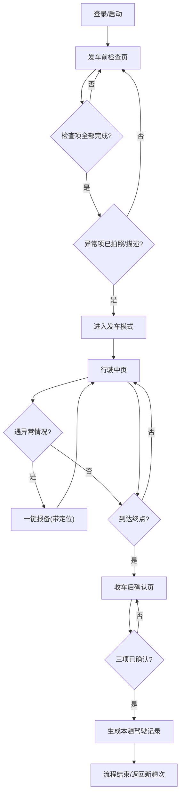

## 1. 产品概述

面向校车司机的极简车载平板端安全确认应用，服务"发车前—行驶中—收车后"三大场景。把车辆检查、行驶提示、收车确认固化为三步可操作流程：异常项强制拍照或描述才能发车，行驶中一键报备自动带定位，收车后生成可留痕的驾驶记录。

目标用户为校车司机；核心价值是"少看屏、快确认、全留痕"，帮助校车公司落实每日安全执行合规，保障学生通勤安全。

## 2. 核心功能

### 2.1 用户角色

| 角色 | 登录方式 | 核心权限 |
|------|----------|----------|
| 校车司机 | 工号 + 车牌绑定 | 执行三段式确认、查看本人本趟驾驶记录 |

> 管理端不在本应用范围，仅通过驾驶记录留痕供校车公司查阅。

### 2.2 功能模块

1. **发车前检查页**：行程概览、车辆检查项清单、异常项拍照/描述、检查进度、发车准入校验
2. **行驶中页**：当前线路、下一站、限速提示、偏离路线提醒、一键报备、到站结束
3. **收车后确认页**：结束确认三项、本趟驾驶记录生成与展示

### 2.3 页面详情

| 页面名称 | 模块名称 | 功能描述 |
|----------|----------|----------|
| 发车前检查页 | 行程概览 | 显示线路、车号、司机、日期、计划站点数 |
| 发车前检查页 | 检查项清单 | 5 项检查（安全带/灭火器/车门/摄像头/定位状态），每项"正常/异常"二选一 |
| 发车前检查页 | 异常项处理 | 标记异常后展开拍照入口与一句描述输入，至少完成其一 |
| 发车前检查页 | 检查进度 | 顶部进度条显示已完成项数/总项数 |
| 发车前检查页 | 发车准入 | 全部检查完成且异常项已处理，"进入发车模式"按钮激活 |
| 行驶中页 | 线路信息 | 大字号显示当前线路名与下一站名 |
| 行驶中页 | 限速提示 | 显示当前限速值，超速时红色高亮脉冲警示 |
| 行驶中页 | 偏离路线提醒 | 检测偏离路线时顶部横幅告警，点击可一键报备 |
| 行驶中页 | 一键报备 | 大按钮触发报备面板，选择原因（堵车/临时封路/事故）自动带定位与时间 |
| 行驶中页 | 到站结束 | "到达终点"按钮进入收车流程 |
| 收车后确认页 | 结束确认三连 | 车辆已停放/钥匙已交回/车内无学生滞留，逐项勾选确认 |
| 收车后确认页 | 驾驶记录 | 展示本趟时长、里程、检查异常数、报备记录等留痕信息 |

## 3. 核心流程

司机登录后进入发车前检查页，逐项点选正常/异常；任一异常项必须拍照或填写一句描述，否则无法发车。全部检查通过后进入行驶中页，行驶中以大字号少文字展示线路、下一站、限速与偏离提醒，遇堵车/封路/事故可一键报备并自动携带位置；到达终点后进入收车后确认页，确认车辆已停放、钥匙已交回、车内无学生滞留后，平台生成本趟驾驶记录留痕。

## 4. 用户界面设计

### 4.1 设计风格

- **主题方向**：Transport Control（运输驾驶舱）工业安全风。深色驾驶舱底色降低行车反光，安全琥珀色作为品牌强调色，交通灯式状态色（绿=正常、琥珀=报备/提示、红=异常/超速）。
- **主色**：深炭黑底 `#0B0F14`；强调色安全琥珀 `#FFB300`；正常绿 `#2EC27E`；异常红 `#FF5A5F`；提示琥珀 `#FFC857`。
- **按钮风格**：大尺寸圆角矩形触控按钮，正常/异常双色对比，按下有物理凹陷反馈与微光晕。
- **字体**：拉丁与数字用 Chakra Petch（技术工业感）；中文用 Noto Sans SC，标题加粗、数值超大字号。
- **布局风格**：卡片化分块 + 顶部状态栏；行驶中页极简大字、按钮居中。
- **图标风格**：线性图标（lucide），与状态色搭配，少而克制。

### 4.2 页面设计概览

| 页面名称 | 模块名称 | UI 元素 |
|----------|----------|---------|
| 发车前检查页 | 顶部状态栏 | 线路/车号/日期，深底琥珀强调，左侧返回 |
| 发车前检查页 | 进度条 | 顶部细进度条，完成项随选填递增 |
| 发车前检查页 | 检查项卡片 | 图标+名称+正常/异常双按钮，异常展开拍照+描述输入 |
| 发车前检查页 | 发车按钮 | 底部固定大按钮，未满足条件置灰，满足后琥珀高亮 |
| 行驶中页 | 线路/下一站 | 超大字号居中，下一站带箭头 |
| 行驶中页 | 限速提示 | 圆形限速盘，超速红光脉冲 |
| 行驶中页 | 偏离告警 | 顶部红色横幅，含一键报备入口 |
| 行驶中页 | 一键报备按钮 | 底部琥珀大按钮，弹出原因选择面板 |
| 收车后确认页 | 结束确认三连 | 三张大卡片逐项确认，勾选后变绿 |
| 收车后确认页 | 驾驶记录 | 概览统计 + 报备明细时间线 |

### 4.3 响应式

- 桌面/平板优先（横屏 1280×800 为基准），触控优化，最小可点击区域 56px。
- 适配竖屏平板与桌面预览，关键控件在窄屏堆叠。

### 4.4 3D 场景

不适用。
