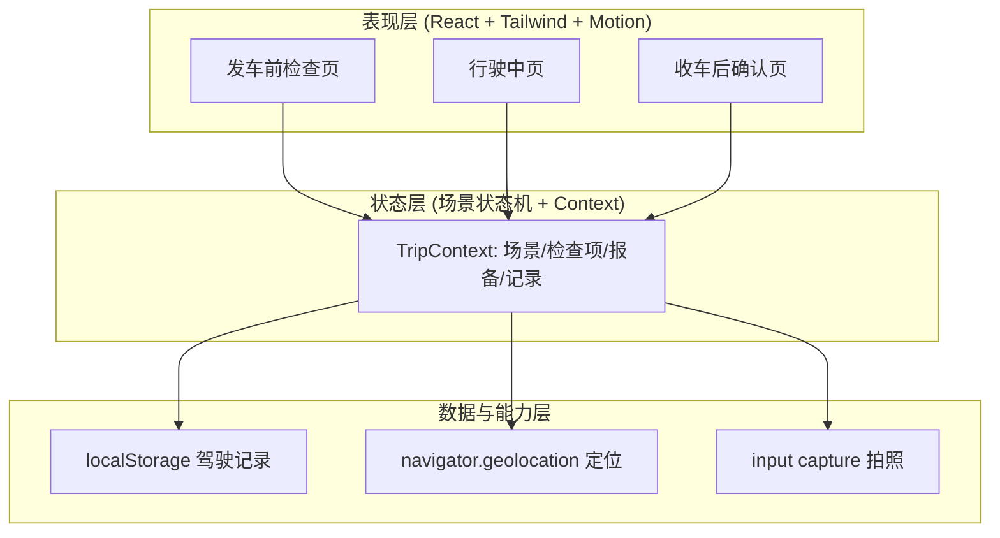
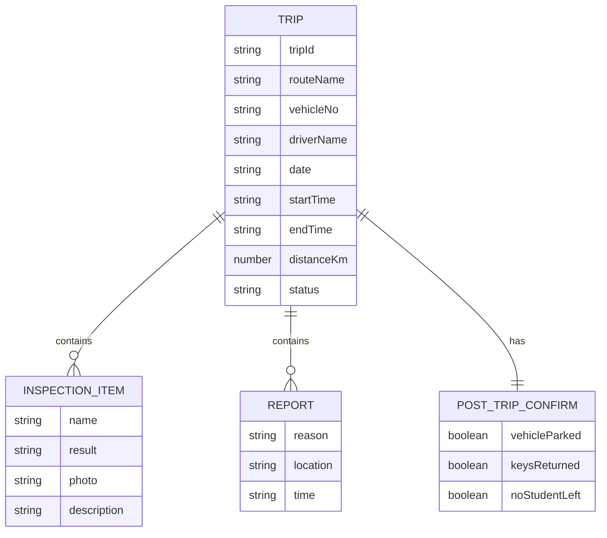

## 1. 架构设计

纯前端单页应用，三层结构：表现层（React 组件 + Tailwind）、状态层（场景状态机 + Context）、数据层（localStorage 留痕 + 浏览器 Geolocation/camera 能力）。无后端，驾驶记录本地持久化，可在管理端接入前作为留痕占位。



## 2. 技术说明

- 前端：React@18 + tailwindcss@3 + vite
- 初始化工具：vite (`npm create vite@latest`)
- 动画：framer-motion@11（页面切换、按钮反馈、告警脉冲）
- 图标：lucide-react
- 后端：无（本地留痕，预留记录导出）
- 数据库：无；使用 localStorage 持久化驾驶记录，结构化 JSON 存储
- 定位/拍照：浏览器原生 Geolocation 与 `input[capture]` 能力，不可用时回退模拟数据

## 3. 路由定义

应用为车载 kiosk 式三段流程，使用应用内场景状态机切换（非 URL 路由），便于锁定流程：

| 场景状态 | 用途 |
|----------|------|
| `pre-trip` | 发车前车辆检查 |
| `driving` | 行驶中提示与报备 |
| `post-trip` | 收车后确认与记录 |
| `completed` | 本趟记录已生成，可开始新趟次 |

入口 `index.html` 加载单页；状态机初始为 `pre-trip`，仅向前流转，收车确认完成进入 `completed` 后可重置开始新趟次。

## 4. API 定义

无后端 API。前端能力调用：

- `navigator.geolocation.getCurrentPosition()`：一键报备时获取经纬度（失败回退"定位不可用"占位）
- `<input type="file" accept="image/*" capture="environment">`：异常项拍照
- localStorage 读写键 `schoolbus_trip_records`：驾驶记录数组

## 5. 服务端架构

不适用（无后端）。

## 6. 数据模型

### 6.1 数据模型定义



### 6.2 数据定义语言

无 SQL。前端 localStorage 结构示例（JSON）：

```json
{
  "schoolbus_trip_records": [
    {
      "tripId": "T20260618-001",
      "routeName": "3号线·阳光小学环线",
      "vehicleNo": "苏B·1234校",
      "driverName": "王师傅",
      "date": "2026-06-18",
      "startTime": "07:10",
      "endTime": "08:05",
      "distanceKm": 12.4,
      "status": "completed",
      "inspections": [
        { "name": "安全带", "result": "normal" },
        { "name": "灭火器", "result": "abnormal", "photo": "data:image/...", "description": "压力指针在红区" }
      ],
      "reports": [
        { "reason": "堵车", "location": "31.49,120.30", "time": "07:32" }
      ],
      "postTripConfirm": {
        "vehicleParked": true,
        "keysReturned": true,
        "noStudentLeft": true
      }
    }
  ]
}
```
